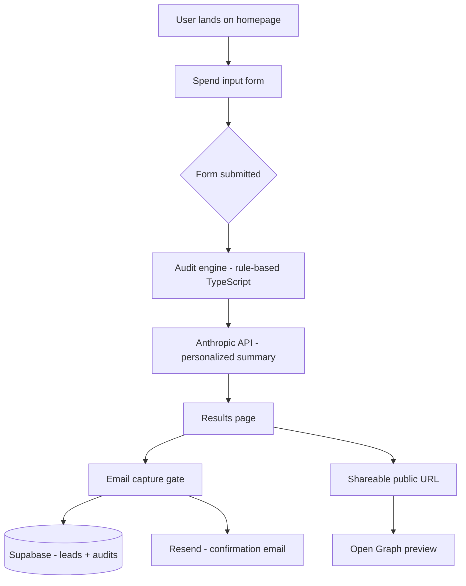

# Architecture

## What this is
AI Spend Audit is a free web tool that lets startup founders and engineering managers audit their AI tool spending, identify overspend, and get a personalized savings report.

## System diagram

## Data flow
1. User fills in tools, plans, seats, team size, use case on the form
2. Form state is persisted in localStorage on every change
3. On submit, data is sent to `/api/audit` which runs the audit engine
4. Audit engine applies deterministic rules (no AI) to produce savings recommendations
5. Anthropic API generates a ~100-word personalized summary paragraph
6. Audit is stored in Supabase with a UUID — this becomes the shareable URL
7. On email capture, lead is stored separately in Supabase and a confirmation email is sent via Resend

## Stack choices
- **Next.js 14 (App Router)**: Server components + API routes in one framework. Vercel deployment is seamless.
- **TypeScript**: The audit engine has complex types. TypeScript catches bugs at compile time.
- **Tailwind + shadcn/ui**: Fast, accessible UI components. Not a pre-built template — all layout is custom.
- **Supabase**: Postgres with a generous free tier. Built-in RLS for security.
- **Resend**: Simplest transactional email API. Free tier is sufficient.

## Scaling to 10k audits/day
- Audit engine is stateless — scales horizontally with no changes
- Add Redis (Upstash) for rate limiting instead of in-memory
- Add Supabase read replicas for the shareable URL lookups
- Move Anthropic API call to a background queue (Inngest or Trigger.dev) to avoid blocking the UI
- Add a CDN cache layer for shareable result pages (they're immutable)